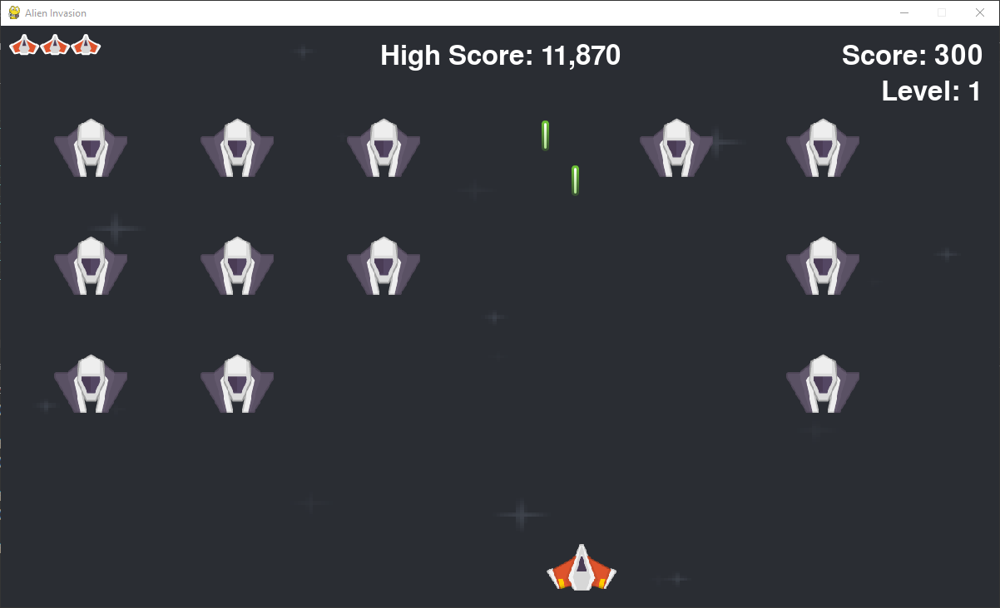

# Alien Invasion 👾

The Alien Invasion Game is developed using Pygame. Throughout this project, I've learned how to break down complex problems into smaller, manageable tasks and solve them systematically This experience has also strengthened my understanding of Object-Oriented Programming (OOP) concepts and improved my ability to organize and refine code through refactoring맚echniques.



## Technologies

- Python
- Pygame

## Prerequisites

- Python 3.8+ installed (verify with `python --version`)
- pip (comes with modern Python)

## Setup (Windows PowerShell)

```powershell
# 1) Create and activate a virtual environment
python -m venv .venv
. .\.venv\Scripts\Activate.ps1

# 2) Upgrade pip and install dependencies
python -m pip install --upgrade pip
pip install pygame

# 3) Install pygame module in an active virtual enviroment
pip install pygame
```

## Run the game

```powershell
python alien_invasion.py
```

## Controls

- Left/Right Arrow Keys: Move ship
- Space: Fire bullet
- Q: Quit game

## Project structure

```
alien_invasion/
├─ alien_invasion.py        # Game entry point
├─ settings.py              # Game settings
├─ ship.py                  # Player ship
├─ bullet.py                # Player bullets
├─ alien.py                 # Alien enemy
├─ life.py                  # Lives/health display
├─ game_stats.py            # Score, level, game state
├─ scoreboard.py            # Scoreboard rendering
├─ button.py                # UI buttons (e.g., Play)
├─ images/                  # Sprites/backgrounds
├─ Bonus/                   # Fonts and sound effects
└─ all-time-high-score.txt  # Persistent high score
```

## Notes

- High score persists between sessions via `all-time-high-score.txt`.
- If audio issues occur, ensure your system audio drivers are up to date; Pygame will gracefully run without sound if needed.